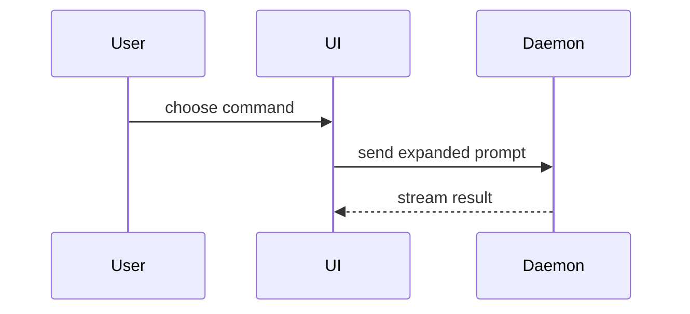

# <Feature name> — System Architecture
 
## Component inventory
[Two explicit lists: **Existing, reused**: components already in the
codebase this feature builds on, with a one-line note on how each is
used. **New**: components introduced by this feature. Each entry must
include the argument for why no existing component could absorb it.]

[Then a Mermaid diagram showing how the components interact — every component
from both lists must appear, and every edge must be labeled with what crosses
it (request, event, data). Distinguish new from existing visually:]

### Explicitly not built
[components that are not built as part of this feature, explicitly rejected.]

## Contracts
[For each endpoint/message: shape of request, shape of response, error
semantics (which failures are surfaced how), auth requirements. Precise
enough that two independent agents could build the two sides of the
interface without talking to each other.]
 
## Data model
[Entities, relationships, ownership, cardinality. Entity level — not DDL,
not ORM models.]
 
## Event / queue topology
[Producers, consumers, delivery guarantees, ordering assumptions. Omit the
section if there is none — do not invent async infrastructure.]
 
## Flows
[One sequence flow per key acceptance criterion from the PRD, referencing
criteria by number (AC-1, AC-2 ...). This is the traceability link: every
acceptance criterion must appear in at least one flow.]
 
## Failure & consistency posture
[Partial-failure behavior, idempotency, retry policy, what state can be
temporarily inconsistent and for how long.]
 
## Decisions
[Mini-ADRs. For every non-obvious choice: the decision, the alternatives
considered, why they were rejected. This section is what makes the document
reviewable rather than merely readable.]
 
## Open questions
